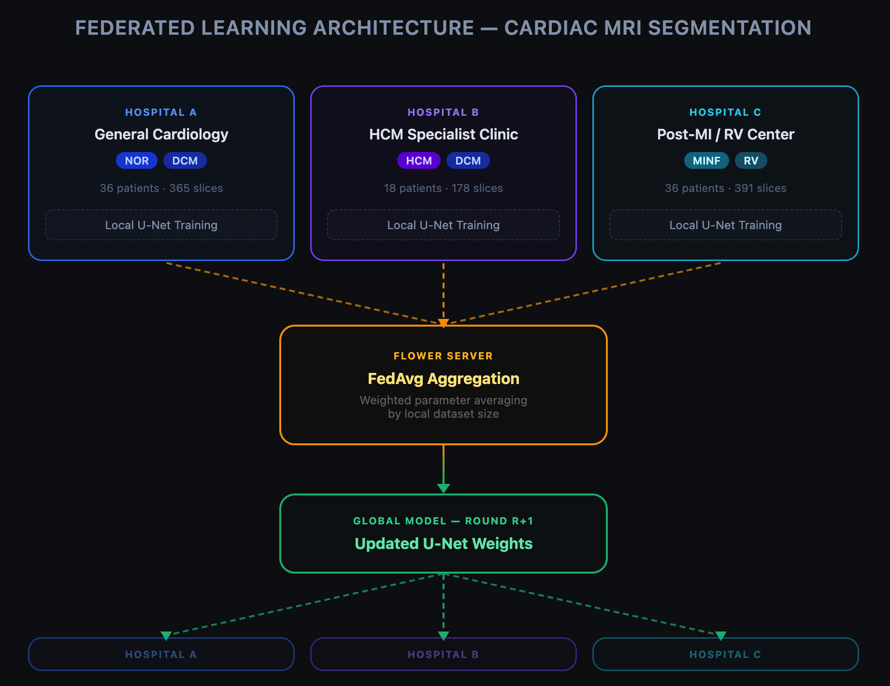

# Federated Learning for Cross-Institutional Cardiac MRI Segmentation

> 跨院聯邦學習應用於心臟 MRI 影像分割

This project simulates a multi-hospital federated learning framework for cardiac MRI segmentation, motivated by the real-world challenge of training AI models across institutions without sharing patient data.

## Background & Motivation

Training deep learning models for medical image analysis requires large, diverse datasets. However, patient data is protected by privacy regulations and cannot be centralized. This project addresses the problem by:

1. Simulating three hospitals with heterogeneous patient populations (Non-IID)
2. Training a shared U-Net model using Federated Averaging (FedAvg)
3. Evaluating the privacy-accuracy trade-off with Differential Privacy (DP)

The cardiac segmentation task (left ventricle, right ventricle, myocardium) uses the public **ACDC** dataset and directly extends prior work on single-site cardiac AR surgical planning.

---

## Architecture



**Non-IID設定（模擬現實）**

| Hospital | Dominant Pathology | Clinical Analogy |
|---|---|---|
| A | NOR, DCM | General cardiology center |
| B | HCM, DCM | Specialized HCM clinic |
| C | MINF, RV | Post-MI / RV disease center |

---

## Experiments

| Experiment | Description |
|---|---|
| `single_site` | U-Net trained on Hospital A only (baseline) |
| `fedavg_iid` | FedAvg with equal random data split |
| `fedavg_noniid` | FedAvg with pathology-based Non-IID split |
| `fedavg_noniid_dp` | FedAvg + Differential Privacy (ε ≈ 10) |

---

## Results

After running experiments, three plots are generated in `results/`:

- **convergence.png** — Dice Score per round for all experiments
- **final_dice_bar.png** — Final test Dice Score comparison
- **dp_tradeoff.png** — Privacy-accuracy trade-off analysis

---

## Dataset

This project uses the **ACDC (Automated Cardiac Diagnosis Challenge)** dataset.

- **Source:** [https://acdc.creatis.insa-lyon.fr/](https://humanheart-project.creatis.insa-lyon.fr/database/#collection/637218c173e9f0047faa00fb/folder/637218e573e9f0047faa00fc)
- **Paper:** O. Bernard, A. Lalande, C. Zotti, F. Cervenansky, et al., "Deep Learning Techniques for Automatic MRI Cardiac Multi-structures Segmentation and Diagnosis: Is the Problem Solved?" in *IEEE Transactions on Medical Imaging*, vol. 37, no. 11, pp. 2514–2525, Nov. 2018.
- **License:** Free for research use; registration required. See `MANDATORY_CITATION.md` inside the dataset.

> The raw data (~1.5 GB) is **not included** in this repository due to size constraints.
> Download the training set and extract to `data/acdc/training/`.

---

## Setup

```bash
# 1. Create environment
conda create -n fedcardiac python=3.10
conda activate fedcardiac

# 2. Install dependencies
pip install -r requirements.txt

# 3. Download ACDC dataset
# Register at https://acdc.creatis.insa-lyon.fr/
# Extract training data to: data/acdc/training/
```

---

## Usage

```bash
# Run all 4 experiments + generate plots (recommended)
python run_experiments.py

# Or run individually:
python train_single_site.py                      # Baseline
python simulate.py --mode iid                    # FedAvg IID
python simulate.py --mode noniid                 # FedAvg Non-IID
python simulate.py --mode noniid_dp              # FedAvg Non-IID + DP

# Generate plots from saved results
python utils/visualization.py
```

---

## Project Structure

```
federated-cardiac/
├── config.py                  # Centralized hyperparameters
├── train_single_site.py       # Single-site baseline
├── simulate.py                # Federated simulation (Flower)
├── run_experiments.py         # Run all experiments end-to-end
├── data/
│   ├── acdc_dataset.py        # ACDC loader (NIfTI → 2D slices)
│   └── split.py               # IID / Non-IID hospital splits
├── models/
│   └── unet.py                # Lightweight 2-D U-Net
├── fl/
│   ├── client.py              # Flower NumPy client
│   └── server.py              # FedAvg strategy + DP wrapper
├── utils/
│   ├── metrics.py             # Dice Score (per-class & mean)
│   ├── trainer.py             # Local training loop
│   └── visualization.py      # Convergence & bar plots
└── results/                   # Saved checkpoints & plots
```

---

## Key Technical Choices

- **2-D slice-based training**: Each MRI volume is decomposed into axial slices, enabling larger effective batch sizes and faster iteration.
- **Non-IID by pathology**: Rather than a random split, hospitals are assigned patients by diagnosis group, reflecting real-world clinical specialization.
- **FedAvg weighted aggregation**: Client contributions are weighted by local dataset size, reducing bias from unequal hospital sizes.
- **Server-side DP clipping**: Gaussian noise and gradient clipping are applied at the server after aggregation, following the DP-FedAvg formulation.

---

## References

- McMahan et al., *Communication-Efficient Learning of Deep Networks from Decentralized Data* (FedAvg), AISTATS 2017
- O. Bernard, A. Lalande, C. Zotti, F. Cervenansky, et al., "Deep Learning Techniques for Automatic MRI Cardiac Multi-structures Segmentation and Diagnosis: Is the Problem Solved?" in *IEEE Transactions on Medical Imaging*, vol. 37, no. 11, pp. 2514–2525, Nov. 2018.
- Balle et al., *Federated Learning with Formal Differential Privacy Guarantees*, 2020
- Flower: *A Friendly Federated Learning Framework*, https://flower.ai
